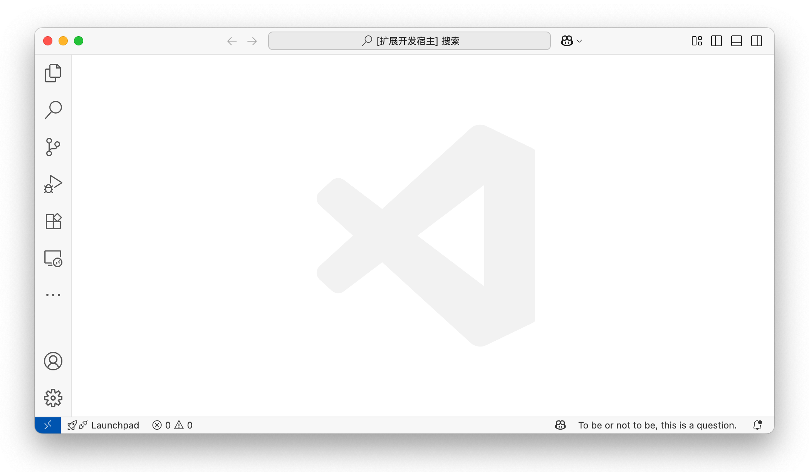

# sreader

Secret reader, a handy tool to quietly read local text files at the far right of the VS Code status bar.

## Features

- Display the content of a local text file in the far right of the status bar.
- Click "book" icon to setting "text path" "page size" and "current offset".
- Toggle content at any time.
- Support for paging up and down.
- Clear all reading progress.

## Installation

1. Available on VS Code Marketplace - search for "sreader".
2. Or build from source and install via VSIX.

## Usage

**Tip**: We recommend setting up keyboard shortcuts for the main commands for the most seamless reading experience!

1. Configure the local text file path (`sreader.textPath`) and page size (`sreader.pageSize`) in the settings.
2. Use the vscode Command Palette and enter the following commands:
   - `Toggle Secret Reader`: Display content
   - `Page Up Secret`: Navigate to previous page  
   - `Page Down Secret`: Navigate to next page
   - `Clear All Secret Offsets`: Reset all reading progress

The content will be displayed as a single line at the far right of the status bar, perfect for discreet reading.

## Configuration

| Setting             | Type    | Default | Description                  |
|---------------------|---------|---------|------------------------------|
| sreader.textPath    | string  | ""      | Path to the local text file  |
| sreader.pageSize    | number  | 40      | Number of characters per page|

## Commands

| Command                 | Description     | Recommand Keyboard Shortcuts |
|-------------------------|-----------------| -----------------------------|
| sreader.toggle          | Toggle content  | ctrl+shift+up
| sreader.pageUp          | Previous page   |                              |
| sreader.pageDown        | Next page       | ctrl+shift+down              |
| sreader.clear           | Clear progress  |                              |

## Examples

## License

MIT

