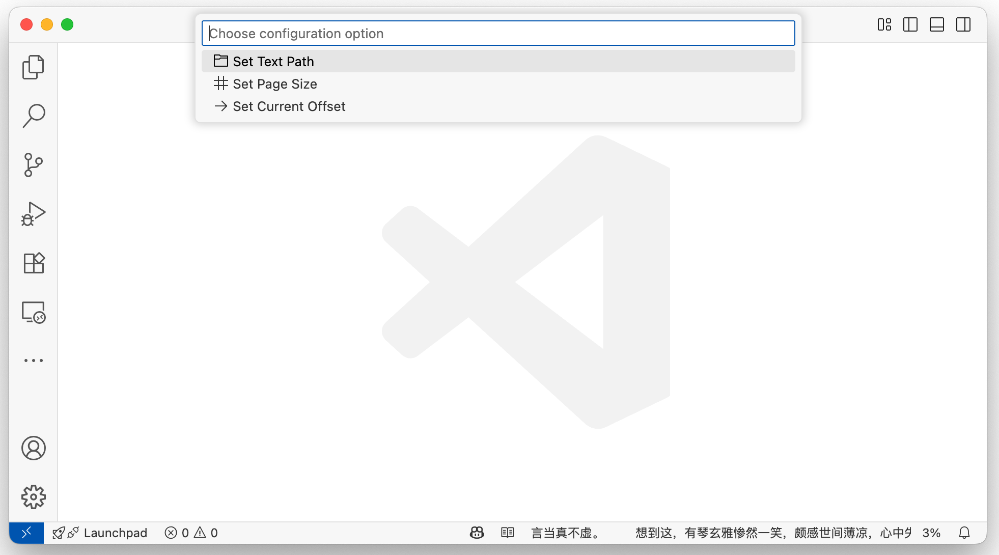

# sreader

Secret reader, a handy tool to quietly read local text files at the far right of the VS Code status bar.

## Features

- Display the content of a local text file in the far right of the status bar
- Support for paging up and down
- Show/hide content
- Quit reading at any time

## Installation

1. Search for `sreader` in the VS Code Extension Marketplace and install it.
2. Or build from source and install via VSIX.

## Usage

1. Configure the local text file path (`sreader.textPath`) and page size (`sreader.pageSize`) in the settings.
2. Use the Command Palette (Cmd+Shift+P) and enter the following commands:
   - `Show Secret`: Show content
   - `Page Up Secret`: Previous page
   - `Page Down Secret`: Next page
   - `Hide Secret content`: Hide content
   - `Quit Secret reader`: Quit reading
   - `Clear all secret offsets`: Clear the reading progress

The content will be displayed as a single line at the far right of the status bar, perfect for discreet reading.

## Configuration

| Setting             | Type    | Default | Description                  |
|---------------------|---------|---------|------------------------------|
| sreader.textPath    | string  | ""      | Path to the local text file  |
| sreader.pageSize    | number  | 40      | Number of characters per page|

## Commands

| Command                 | Description      |
|-------------------------|-----------------|
| sreader.show            | Show content    |
| sreader.pageUp          | Previous page   |
| sreader.pageDown        | Next page       |
| sreader.hide            | Hide content    |
| sreader.quit            | Quit reading    |
| sreader.clear           | Clear progress  |

## Examples

## License

Apache-2.0

